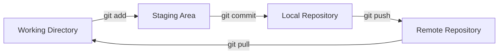
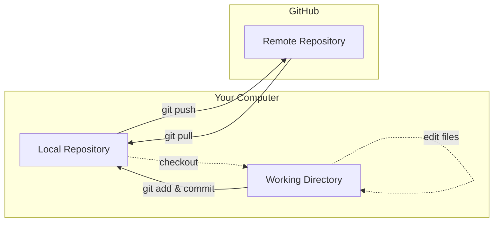

# Git and GitHub Basics

## Git

### Key Git Concepts

- Repository (Repo): A repository is a folder that contains your project files and the entire history of changes made to those files.
- Working Directory: This is your local folder where you edit files. It's what you see and interact with directly.
- Staging Area (Index): A temporary area where you prepare changes before permanently saving them to the repository.
- Commit: A snapshot of your project at a specific point in time, with a descriptive message about what changed.

### Basic Git Workflow & Commands



1. **Clone or init** repository
2. **Edit files** in your working directory
3. **Stage changes** using `git add` - this tells Git which changes you want to include in your next commit
4. **Commit changes** using `git commit` - this permanently saves the staged changes to your repository
5. **Push changes** using `git push` - this uploads your commits to a remote repository (like GitHub, more on this later)

```bash
# Initialize a new Git repository
git init
# or
git clone <repository-url> # clone an existing remote repository

# View commit history
git log

# Add specific files to staging area
git add <filename>
# OR
git add . # add all files to staging area

# view git status
git status

# Commit staged changes
git commit -m "Your commit message"

# add git remote
git remote add <name> <url> # by convention we usually name our upstream "origin"

# push changes to remote repo
git push origin
# OR
git push # will default to the configured remote repo

```

### "Undo" Changes

- `git revert`: undo changes in a specific commit (see [doc](https://git-scm.com/docs/git-revert))
- `git reset`: reset current HEAD to a specific commit (see [doc](https://git-scm.com/docs/git-reset))
  - `soft`: I want to reset history, and keep the changes in staging area
  - `mixed` (default): I want to reset history, and keep the changes unstaged
    - People also use this command to unstaged changes. However, in newer version of git introduced `git restore` ([doc](https://git-scm.com/docs/git-restore)) which is designated for unstaging changes
  - `hard`: I want to reset history, and discard all the changes

## Github

### Git vs GitHub

- Git
  - Version Control System
  - Works locally
  - CLI tool
- GitHub
  - Web-based Platform
  - Hosts Git Repos
  - Collaboration features

#### Analogy

- Git is like Microsoft Word. It's the program on your computer that you use to write a document and, crucially, use the "Track Changes" feature. You can save versions, see the history of edits, and revert to old versions, all on your own machine. It is the tool for managing the history of your work.
- GitHub is like Google Docs. It's a website where you can upload your Word document to store it and share it with others.

### GitHub Authentication

In order to make any changes to a given GitHub repo through git, there need ways to make sure you are authorized to read/write a given repo. GitHub supports [two methods](https://docs.github.com/en/authentication/keeping-your-account-and-data-secure/about-authentication-to-github#authenticating-with-the-command-line):

- HTTPS
- SSH (It is generally recommended to use SSH over HTTPS for security reasons. Refer to [GitHub doc](https://docs.github.com/en/authentication/connecting-to-github-with-ssh/about-ssh) for guide on this)

### Basic GitHub Workflow



```bash
# set upstream repo
git remote add origin <github-repository-url>

# Push changes from github (in this case GitHub)
git push origin main

# Pull changes from remote (in this case GitHub)
git pull origin main # This is equivalent to git fetch and then merge, but we won't go into it.

```

## Gitignore

Via `.gitignore`, we can tell git what should never be added to staging area or committed. For example usually we do not want to commit:

- sensitive data or secrets (`.env`, `.env.local`, ...)
- build artifacts (`dist`, `build`, `node_modules`, ...)

### syntax

- Machine Patterns
  - `*` is used as a wildcard match
  - `/` is used to ignore pathnames relative to the `.gitignore` file
  - `#` is used to add comments to a `.gitignore` file

```gitignore
# ignoring all file named ".env" in the dir
.env
# ignoring file extension type
*.log
# ignoring specific directories relative to the root
/logs
# ignoring specific file path ("/build"/"src/build", ...)
logs/
# adding an exception
!important.log
# ignoring all logs folders
**/logs
#ignoring all directories or files containing something
**/*logs
```

| Pattern  | Ignores `<root>/build` (dir) | Ignores `<root>/src/build` (dir) | Ignores `<root>/build` (file) |
| :------- | :--------------------------: | :------------------------------: | :---------------------------: |
| `build`  |             Yes              |               Yes                |              Yes              |
| `/build` |             Yes              |                No                |              Yes              |
| `build/` |             Yes              |               Yes                |              No               |

## and more

### Tool Recommendations

Typing git commands over and over again might be tedious, so there are tools to make git operations easier by providing GUI:

- VSCode Built-in Git integration
- JetBrains IDEs (IntelliJ, PyCharm, WebStorm)
- [Lazygit](https://github.com/jesseduffield/lazygit) (**What I am using**, it provides a TUI that is keyboard centric and intuitive to use)

### Git commit conventions

- [the spec](https://www.conventionalcommits.org/en/v1.0.0/)
- [the cheatsheet](https://gist.github.com/qoomon/5dfcdf8eec66a051ecd85625518cfd13)

### [GitHub CLI](https://cli.github.com)

GitHub provides its own cli called `gh` which enables you to interact with GitHub in your terminal

### Cheatsheet from [tldr](https://github.com/tldr-pages/tldr)

```
 gh

  Work seamlessly with GitHub.
  Some subcommands such as config have their own usage documentation.
  More information: https://cli.github.com/manual/gh.

  Clone a GitHub repository locally:

    gh repo clone owner/repository

  Create a new issue:

    gh issue create

  View and filter the open issues of the current repository:

    gh issue list

  View an issue in the default web browser:

    gh issue view --web issue_number

  Create a pull request:

    gh pr create

  View a pull request in the default web browser:

    gh pr view --web pr_number

  Check out a specific pull request locally:

    gh pr checkout pr_number

  Check the status of a repository's pull requests:

    gh pr status
```
